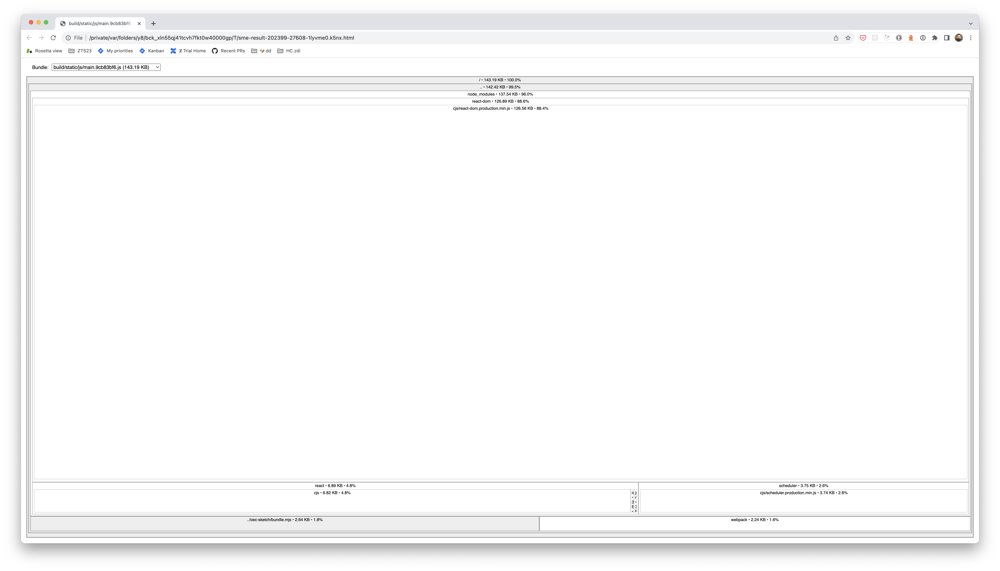
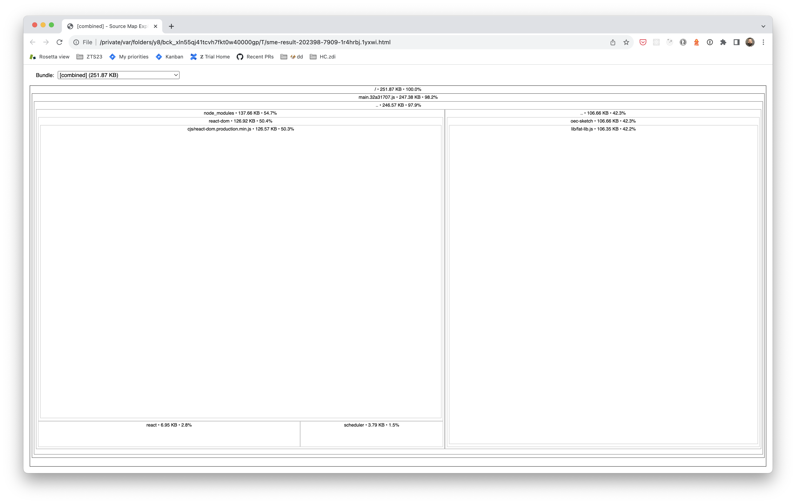

# oec-sketch

**Git history highlights**

[27566ff](https://github.com/mfdj/oec-sketch/blob/27566ff583a1f460dc49a4199c1264aa27dcb00a) Functional UMD package with fat-lib [README](https://github.com/mfdj/oec-sketch/blob/27566ff583a1f460dc49a4199c1264aa27dcb00a/README.md)

[19474ae](https://github.com/mfdj/oec-sketch/blob/19474ae6475980a6f0caeaca4d065f21dc7120aa) Dual ESM + CJS inputs + outputs [README](https://github.com/mfdj/oec-sketch/blob/19474ae6475980a6f0caeaca4d065f21dc7120aa/README.md)

[4ddc71c](https://github.com/mfdj/oec-sketch/blob/4ddc71c1ef0d733a5bf8e2073f7a51856bc845c8) Single ESM input [README](https://github.com/mfdj/oec-sketch/blob/4ddc71c1ef0d733a5bf8e2073f7a51856bc845c8/README.md)

## Details

This project is a basic library with two outputs (ES + CJS) from a single ES input:

```js
import { func79, func59, func39, func19, func9 } from './lib/fat-lib.mjs';

console.log('➳ oec-sketch shared-main evaluation');

export function main() {
  return func79() + func59() + func39() + func19() + func9();
}

export { func99 } from './lib/fat-lib.mjs';
```

### Rollup build + usage in CRA host-app

package.json defines 2 outputs in the **export** field:

```js
{
  "name": "@mfdj/oec-sketch",
  "exports": {
    "import": "./bundle.mjs",
    "require": "./bundle.cjs"
  }
}
```

The Rollup config takes the `main.mjs` input and produces two outputs:

```js
import packageJson from './package.json' with { type: "json" };

export default [
  {
    input: 'main.mjs',
    output: {
      name: 'oecSketch',
      file: packageJson.exports.import,
      format: 'es'
    }
  },
  {
    input: 'main.mjs',
    output: {
      name: 'oecSketch',
      file: packageJson.exports.require,
      format: 'cjs'
    }
  }
];
```

Install packages + build

```sh
$ npm install; npm run build
```

Add to a create-react project using npm add link:

```sh
$ npm add file:../oec-sketch
```

And use in App.jsx:

```jsx
import { main, func99 } from "@mfdj/oec-sketch";

function App() {
  const handleClick = useCallback(() => {
    func99();
    console.log("App ☢️ " + main());
  }, []);

  return (
    <div className="App">
      <header className="App-header" onClick={handleClick}>
        
      </header>
    </div>
  );
}
```

#### ES output: bundle.mjs

```js
function func9(index = 9) {
  // …
}

function func19(index = 19) {
  // …
}

function func39(index = 39) {
  // …
}

function func59(index = 59) {
  // …
}

function func79(index = 79) {
  // …
}

function func99(index = 99) {
  // …
}

console.log('➳ oec-sketch shared-main evaluation');

function main() {
  return func79() + func59() + func39() + func19() + func9();
}

export { func99, main };
```

The tree-shaken bundle is 2.64 KB in the main chunk:



#### CommonJS output: bundle.cjs

```js
'use strict';

const { func99, func79, func59, func39, func19, func9 } = require('./lib/fat-lib.cjs');

console.log('➳ oec-sketch CommonJS evaluation');

function main() {
  return func79() + func59() + func39() + func19() + func9();
}

module.exports = {
  func99,
  main
};
```

Which Jest will use during tests:


#### Former UMD output: bundle.js

Previously the UMD output included:

```js
(function (factory) {
  typeof define === 'function' && define.amd ? define(factory) :
  factory();
})((function () { 'use strict';

  const { func99, func79, func59, func39, func19, func9 } = require('./lib/fat-lib.js');

  console.log('➳ oec-sketch module evaluation');

  function main() {
    return func79() + func59() + func39() + func19() + func9();
  }

  module.exports = {
    func99,
    main
  };

}));
```

The entire library (106.34 KB) was included in the main chunk:


